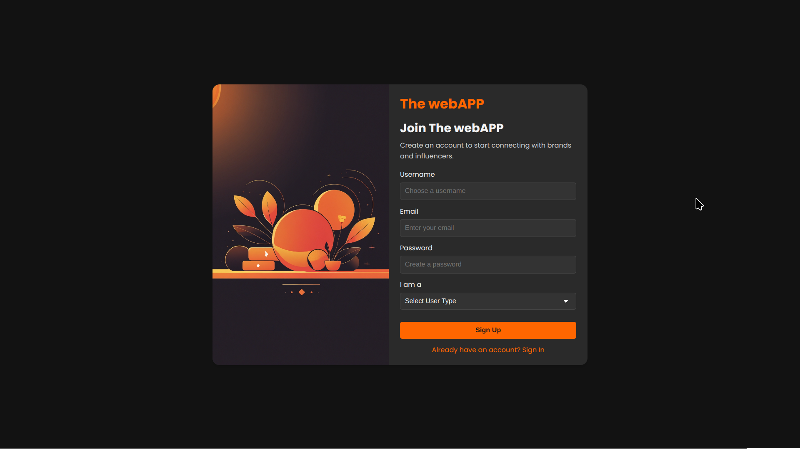
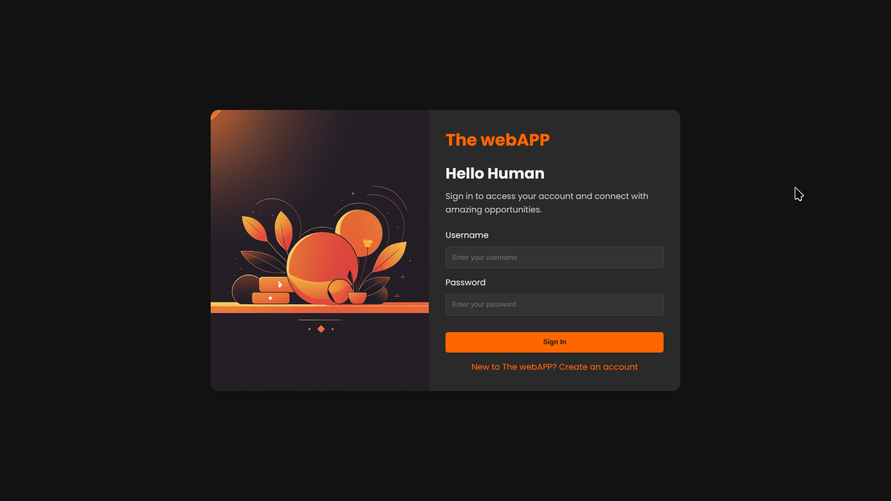
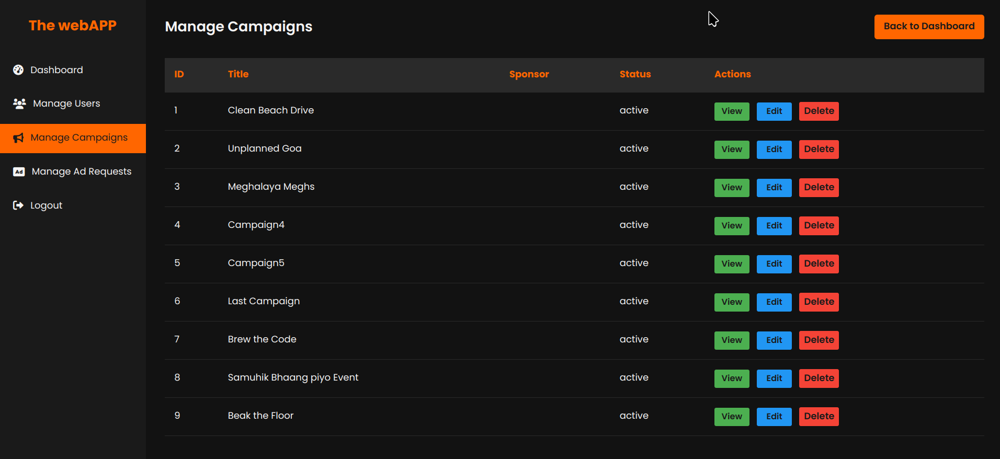

# InfluConnect - Influencer Marketing Platform  

**InfluConnect** is a comprehensive web application designed to connect sponsors with influencers, streamlining the process of creating and managing influencer marketing campaigns. This project achieved a perfect score of **100/100** in the college evaluation and was awarded the **Best Capstone Project** badge.  

### **Home Page: Your Gateway to Influencer Marketing**  
The home page of InfluConnect welcomes users with a clean and intuitive design. The hero section highlights the platform's core features, making it easy for sponsors and influencers to understand the value of the platform at a glance.  

  

---

### **User Authentication: Secure and Seamless Access**  
InfluConnect ensures secure access with its user-friendly signup and signin pages. Whether you're a sponsor, influencer, or admin, the authentication process is smooth and hassle-free.  

  
  

---

### **Sponsor Dashboard: Manage Campaigns with Ease**  
The Sponsor Dashboard is the control center for sponsors. From here, sponsors can create, manage, and track campaigns, view ad requests, and analyze campaign performance—all in one place.  

  

---

### **Influencer Dashboard: Collaborate and Grow**  
The Influencer Dashboard empowers influencers to manage their profiles, respond to ad requests, and collaborate with sponsors. It’s designed to help influencers maximize their reach and engagement.  

  

---

### **Admin Dashboard: Full Control Over the Platform**  
The Admin Dashboard provides administrators with the tools to manage the platform effectively. From user management to flagged accounts, admins have full control to ensure the platform runs smoothly.  

  

---

### **Ad Requests: Streamlined Collaboration**  
The Ad Requests feature allows sponsors to send collaboration requests to influencers. Influencers can respond with acceptance, rejection, or negotiation, making the process transparent and efficient.  

  

---

### **Campaign Management: Organize and Optimize**  
Sponsors can easily manage their campaigns through the Campaign Management interface. From creating new campaigns to tracking their progress, everything is designed for maximum efficiency.  

  

---


## Features  

- **User Authentication**: Secure login and role-based access (admin, sponsor, influencer).  
- **Campaign Management**: Sponsors can create, manage, and track campaigns.  
- **Influencer Search**: Sponsors can search for influencers based on niche, category, and reach.  
- **Ad Requests**: Influencers can respond to sponsor ad requests with acceptance, rejection, or negotiation.  
- **Admin Dashboard**: For managing the platform, including user roles and flagged accounts.  
- **User Profiles**: Detailed profiles for both sponsors and influencers.  

---

## Tech Stack  

**Frontend**:  
- **HTML**: Structuring web pages.  
- **CSS**: Styling for responsive and user-friendly design.  

**Backend**:  
- **Python**: Core backend logic.  
- **Flask**: Web framework for routing and handling requests.  
- **Flask-SQLAlchemy**: ORM for database interactions.  
- **Jinja2**: Dynamic HTML rendering.  
- **SQLite**: Database engine for storing user, sponsor, influencer, and campaign data.  

---


## Setup and Installation  

1. **Create and activate a virtual environment**:  
   ```bash  
   python -m venv venv  
   source venv/bin/activate  
   
   # On Windows, use `venv\Scripts\activate`  
   ```  

2. **Install the required packages**:  
   ```bash  
   pip install -r requirements.txt  
   ```  

3. **Initialize the database**:  
   ```bash  
   python3 database-reset.py  
   ```  
   This script drops all existing tables and recreates them, effectively resetting the database to its initial state.  

4. **Create an admin user**:  
   ```bash  
   flask create-admin  
   ```  

5. **Run the application**:  
   ```bash  
   flask run  
   ```  

6. **Access the application** at `http://localhost:5000`.  

---

## Important Files  

- `app.py`: Main application file containing routes and app configuration.  
- `models.py`: Database models for Users, Sponsors, Influencers, Campaigns, etc.  
- `commands.py`: Custom Flask CLI command to create admin.  
- `database-reset.py`: Script to reset the database.  

---

## Custom Commands  

### `flask create-admin`  
This command creates an admin user in the database. It's defined in `commands.py` and can be run using:  

```bash  
flask create-admin  
```  

The command checks if an admin user already exists. If not, it creates a new admin user with predefined credentials.  

---

## Database Reset  
To reset the database, run:  

```bash  
python database-reset.py  
```  

This script drops all existing tables and recreates them, effectively resetting the database to its initial state.  

---

## Conclusion  

**InfluConnect** is a foundational yet powerful project designed to bridge the gap between sponsors and influencers. Despite being a basic implementation where we were restricted to using only HTML and CSS for the frontend, every feature has been meticulously crafted to deliver a seamless and intuitive user experience. From secure authentication to campaign management and influencer collaboration, InfluConnect demonstrates how simplicity and functionality can coexist. This project not only met but exceeded expectations, earning a perfect score and the title of Best Capstone Project.

---  


