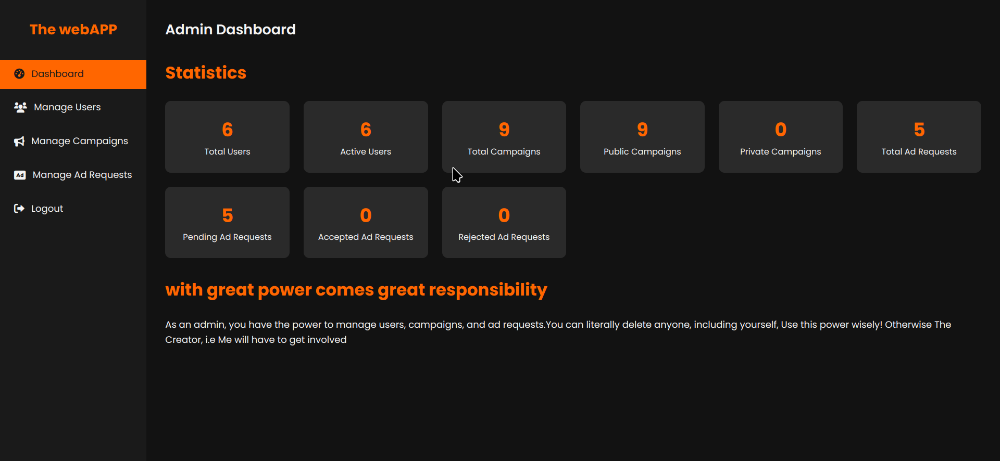
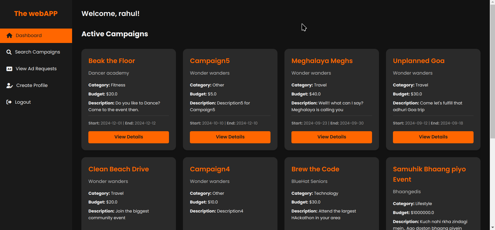
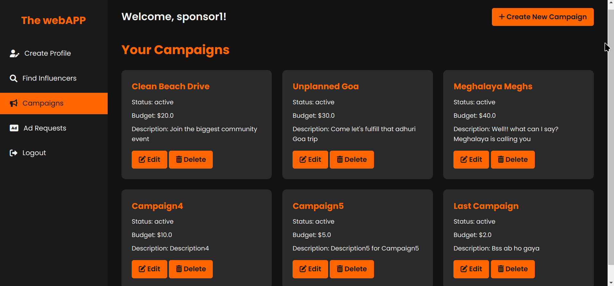

# InfluConnect - Influencer Marketing Platform


## 🚀 Overview

**InfluConnect** is a full-stack influencer campaign management platform built using **Python (Flask)**. It connects sponsors with influencers, enabling seamless ad requests, campaign creation, profile browsing, and campaign tracking — all within one streamlined application.

This project is fully developed and maintained by **Chanaksha (Chanaksha2003)**.

---

## 🔧 Features

- 👥 **User Roles**: Influencer, Sponsor, and Admin
- 📢 **Campaign Management**: Create, edit, assign, and manage influencer campaigns
- 🔍 **Influencer Search**: Filter by niche, reach, or channel type
- ✅ **Ad Requests**: Sponsors can create and assign requests to influencers
- 📊 **Admin Dashboard**: Monitor users, campaigns, and platform activity
- 🔐 **User Authentication**: Secure sign-in/sign-up with session handling
- 📈 **YouTube Stats Integration** (via YouTube Data API v3)

---

## 🛠️ Tech Stack

| Layer       | Tools / Libraries                          |
|-------------|--------------------------------------------|
| Backend     | Python, Flask, Flask-SQLAlchemy            |
| Frontend    | HTML, CSS, Jinja2                          |
| Database    | SQLite                                     |
| APIs        | YouTube Data API v3                        |
| Version Control | Git, GitHub                           |

---

## 📂 Folder Structure

```plaintext
InfluConnect/
├── app.py
├── models.py
├── templates/
│   ├── *.html
├── static/
│   ├── css/
│   └── images/
├── youtube_utils.py
├── requirements.txt
├── README.md
└── samples/        # Screenshots for preview
```

---

## 🖼️ Sample Screenshots

| Dashboard | Influencer View | Sponsor View |
|----------|------------------|--------------|
|  |  |  |

---

## ⚙️ How to Run Locally

1. **Clone the repository**
```bash
git clone https://github.com/Chanaksha2003/InfluConnect.git
cd InfluConnect
